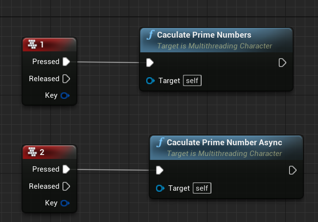
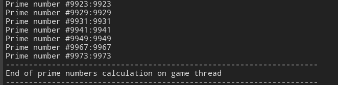
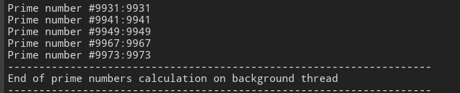

# 多线程demo

## 为什么要多线程？

现在的计算机都支持多线程处理任务

一般来说主线程负责游戏的渲染，被称为游戏线程，其他线程再后台执行逻辑。

如果只在一个游戏线程执行大量操作，很可能遇到游戏冻结。

## 案例介绍

使用游戏线程和其他线程分别执行一段代码

~~~cpp
namespace ThreadingTest
{
    //测试用函数：计算素数
	static void CaculatePrimeNumbers(int32 UpperLimit)
	{
		for (int32 i = 1; i <= UpperLimit; ++i)
		{
			bool isPrime = true;
			for (int32 j = 2; j <= i/2; ++j)
			{
				if (FMath::Fmod(i, j) == 0)//对浮点数进行取模（求余）
				{
					isPrime = false;
					break;
				}
			}
			if(isPrime)GLog->Log("Prime number #"+FString::FromInt(i)+":"+FString::FromInt(i));
		}
	}
}
~~~

~~~cpp
	//游戏线程执行
	UFUNCTION(BlueprintCallable,Category = MultiThreading)
	void CaculatePrimeNumbers();
	//其他线程执行
	UFUNCTION(BlueprintCallable,Category = MultiThreading)
	void CaculatePrimeNumberAsync();

	UPROPERTY(EditAnywhere,Category = MultiThreading)
	int32 MaxPrime;
~~~

~~~cpp
void AMultithreadingCharacter::CaculatePrimeNumbers()
{
	ThreadingTest::CaculatePrimeNumbers(MaxPrime);//当前线程直接调用函数
}

void AMultithreadingCharacter::CaculatePrimeNumberAsync()
{
	(new FAutoDeleteAsyncTask<PrimeCaculationAsyncTask>(MaxPrime))->StartBackgroundTask();
    //创建新的线程PrimeCaculationAsyncTask
}
~~~

~~~cpp
class PrimeCaculationAsyncTask : public FNonAbandonableTask
{
	int32 m_MaxPrime;

public:
	PrimeCaculationAsyncTask(int32 MaxPrime)：m_MaxPrime(MaxPrime){}

	FORCEINLINE TStatId GetStatId()const
	{
        //返回循环计数器
		RETURN_QUICK_DECLARE_CYCLE_STAT(PrimeCaculationAsyncTask, STATGROUP_ThreadPoolAsyncTasks);
	}
    
//StartBackgroundTask()时执行
	void DoWork()
	{
		ThreadingTest::CaculatePrimeNumbers(m_MaxPrime);
		GLog->Log("--------------------------------------------------------------------");
		GLog->Log("End of prime numbers calculation on background thread");
		GLog->Log("--------------------------------------------------------------------");
	}
};
~~~

## 效果

